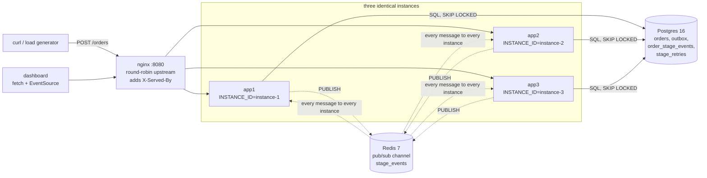
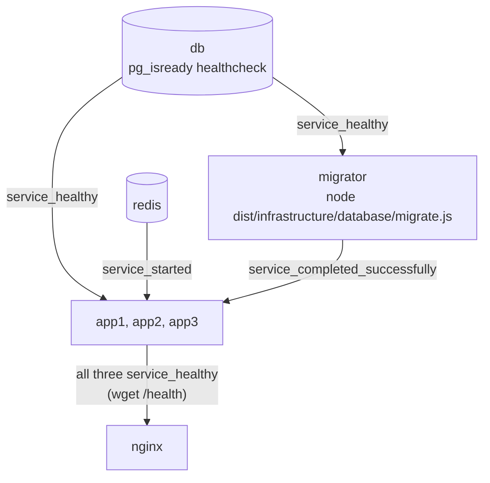
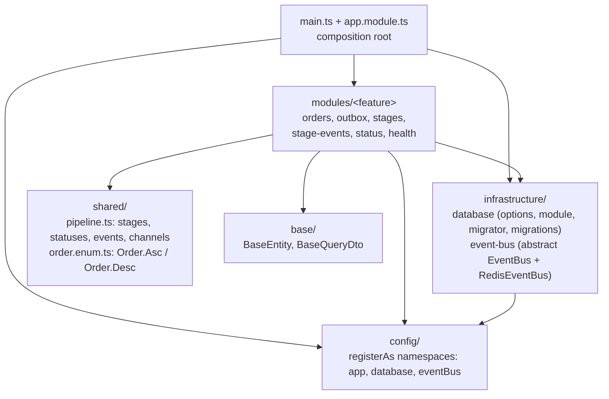
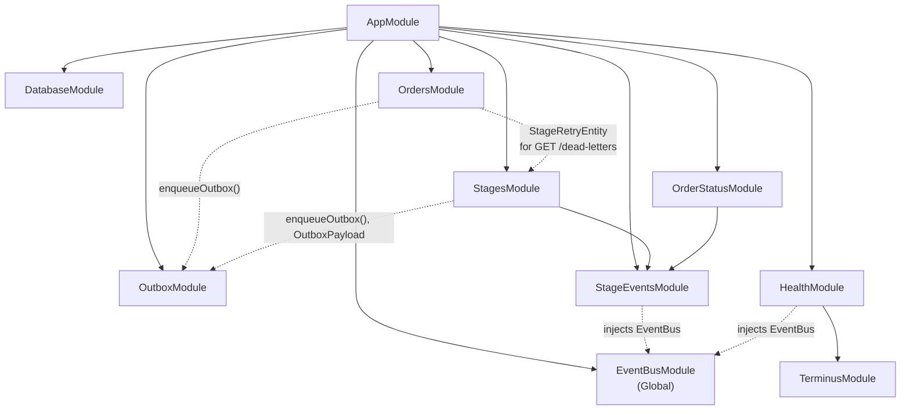

# Architecture

How the system is deployed, how the source is layered, and why it is built the way it is. For
the request and event paths themselves, see [data-flow.md](data-flow.md).

## Deployment

Every app instance is the same image running the same roles: the HTTP API, the outbox relay,
the three stage handlers, the status watcher and the SSE server. There is no leader and no
instance-specific configuration beyond `INSTANCE_ID`.



- **nginx** (`nginx.conf`) round-robins over `app1..app3:3000`. The SSE route
  `/orders/:id/stream` has its own `location` with buffering off, HTTP/1.1, a cleared
  `Connection` header and a one-hour read timeout. `X-Served-By` carries `$upstream_addr`,
  the container's IP and port, not the `INSTANCE_ID`.
- **Postgres** holds all state. Everything that must be correct is decided here.
- **Redis** is only the cross-instance broadcast channel for live frames. Losing a message
  costs a dashboard frame, never data.

### Startup order and the migrator gate

Schema comes from migrations only (`synchronize: false`). Three instances inferring a schema
at boot would race each other to `CREATE TABLE` the same objects, so a one-shot `migrator`
service owns schema creation and the apps wait for it to exit successfully.



`src/infrastructure/database/migrate.ts` builds a `DataSource` via `createDataSource()`, runs
all pending migrations with `transaction: 'all'` and exits. Because it runs the compiled
migrations and then terminates, `depends_on: condition: service_completed_successfully` gates
the app containers on the schema actually existing, not merely on the migrator having started.
A failure exits 1, and the apps never start.

The app healthcheck (`wget http://127.0.0.1:3000/health`) has a 5s timeout because `/health`
runs two pings of up to 1.5s each. See [operations.md](operations.md#what-health-checks).

## Layers



| Layer | Path alias | What lives there |
| --- | --- | --- |
| base | `@base/*` | Classes and shapes others extend. Today: `BaseEntity` (uuid `id`, `created_at`, `updated_at`, soft-delete `deleted_at`) and `BaseQueryDto` (`limit`, `order`) with its defaults in `base.constants.ts`. |
| config | `@config` | One `registerAs()` factory per namespace (`app`, `database`, `eventBus`), the only place `process.env` is read. `configNamespaces` lists them for `ConfigModule.forRoot`. |
| shared | `@shared/*` | `pipeline.ts`: `StageName`, `StageStatus`, `OrderStatus`, `StageRetryStatus`, `OrderEvent`, `EventChannel`, `stageEvent()`, `STAGES`, `STAGE_COUNT`. `order.enum.ts`: `Order` (`Asc`/`Desc`), the sort direction every query uses. |
| infrastructure | `@infrastructure/*` | `database/`: TypeORM options shared by app and migrator, `DatabaseModule`, the migrator entry point, migrations. `event-bus/`: the `EventBus` abstraction and its Redis driver (a `@Global()` module). |
| modules | `@modules/*` | One folder per feature. |

`AppModule` imports config first, then infrastructure (`DatabaseModule`, `EventBusModule`,
`EventEmitterModule`, `ScheduleModule`, `ServeStaticModule` for `public/`), then the features
in pipeline order.

### Per-feature folder layout

```
modules/<feature>/
  <feature>.module.ts   the only file at the feature root
  controllers/          *.controller.ts   HTTP entry points
  dtos/                 *.dto.ts   validated query DTOs extending @base/base-query.dto
  services/             *.service.ts, *.indicator.ts, *.factory.ts   all injectables
  helpers/              *.helper.ts   pure functions
  entities/             *.entity.ts   TypeORM entities, classes suffixed Entity
  types/                <feature>.types.ts   interfaces, enums, raw SQL row types
  consts/               <feature>.constants.ts   tunables and lookup tables
  tests/                *.spec.ts   jest unit tests for the feature's helpers and services
```

A subfolder exists only when the feature has something to put in it (`status/` has only
`services/` and `tests/`). Services, controllers and entities import constants and types rather than
declaring them. Cross-folder imports always use the path aliases, never `../`.

## Module dependency graph

Solid arrows are Nest `imports` (DI wiring). Dashed arrows are plain TypeScript imports of a
helper, entity or type from another feature, with no DI relationship.



`OutboxModule` imports no other feature module: it reaches the stages only through
`EventEmitter2` events (`order.created`, `<stage>.retry`), so the relay has no compile-time
knowledge of who consumes them. `StageEventsModule` exports `StageEventsService`, which both
the stages (to publish) and the status watcher (to subscribe) depend on.

## Design decisions

### Transactional outbox

`POST /orders` inserts the order and an outbox row in one transaction and returns 201. The
event exists if and only if the order does, which "fire an event after the commit" cannot
promise when the process dies between the two. `enqueueOutbox()` is the only insert into
`outbox` and always takes the caller's `EntityManager`, so every outbox row commits with the
change that caused it. See [src/modules/outbox/README.md](../src/modules/outbox/README.md).

### SKIP LOCKED competing consumers

Every instance polls the same table every 2s with `FOR UPDATE SKIP LOCKED`. A row one
instance has locked is invisible to the others for the life of that transaction instead of
making them wait, so three pollers share one table without double-claiming. Retries are
outbox rows too (tagged with their stage and a future `available_at`), so they re-enter the
same race and can run on a different instance than the one that failed.

The relay emits in-process events **without awaiting them** and marks the rows processed in
the same transaction. Awaiting would hold the row locks for the whole simulated stage. The
consequence is that delivery is at-least-once, and every stage handler must never reject.

### Idempotency from a unique index, not from the relay

`order_stage_events` is unique on `(order_id, stage, attempt, status)`. A stage claims an
attempt by inserting its `started` row with `ON CONFLICT DO NOTHING`; a duplicate delivery
inserts nothing and returns. `status` is in the key so the `started`, `completed` and `failed`
rows of one attempt can coexist while a re-delivered `started` still collides.
`StageRunner.record()` is the single write path into that table, so the rule lives in one
place.

### EventBus abstraction, and why it must broadcast

`@nestjs/event-emitter` is in-process. A browser's `EventSource` lands on whichever instance
nginx picks, while the order it watches may be processed by another, so without a
cross-instance bus roughly two-thirds of streams would stay silent.

`EventBus` (`src/infrastructure/event-bus/event-bus.ts`) is an abstract class with `publish`,
`subscribe` and `ping`. It doubles as the DI token: consumers inject `EventBus`, and
`EventBusModule` binds it to `RedisEventBus` in a single `useClass`. Nothing outside
`src/infrastructure/event-bus/` imports ioredis. Payloads go in and come out as values;
serialization is the driver's job.

The contract a replacement driver must meet is **broadcast**: every subscriber on every
instance receives every message, including messages its own instance published. A work-queue
transport that hands each message to one consumer would bring back the silent-stream problem.

`RedisEventBus` details:

- Two connections, as Redis pub/sub requires: one for commands and `PUBLISH`, one (a
  `duplicate()`) pinned to subscriber mode. ioredis re-subscribes after a reconnect.
- Handlers are kept in a local map; only the first handler for a channel issues `SUBSCRIBE`.
  A malformed message or a throwing handler is logged and never propagates.
- The publisher uses `maxRetriesPerRequest: null`, so a command issued while Redis is down is
  queued rather than rejected. That is right for publishing (a frame goes out once Redis is
  back), but it would let a health probe hang forever, which is why `ping()` races the PING
  against a deadline (`DEFAULT_PING_DEADLINE_MS`, 1500ms, overridden by the health module).

Redis was chosen over Postgres `LISTEN`/`NOTIFY` because it is the general answer for
cross-process fan-out; see the root README's "Why Redis".

### Typed configuration via registerAs

All `process.env` reads live in `registerAs()` factories under `src/config/`. Consumers
inject a namespace with `@Inject(appConfig.KEY) app: AppConfig`, where `AppConfig` is
`ConfigType<typeof appConfig>`, so config is typed where it is used. `positiveInt()` makes a
malformed value such as `PORT=abc` fail at boot instead of passing `NaN` to `listen()`.

Every default points at localhost, so `pnpm start:dev` works against
`docker compose up -d db redis migrator` with no env vars. The migrator runs outside Nest's
DI and calls `databaseConfig()` directly: a `registerAs` factory is a plain function as well
as a config namespace.

### One set of database options for app and migrator

`databaseOptions()` (`src/infrastructure/database/database-options.ts`) is used by both
`DatabaseModule` and the migrator's `createDataSource()`, so the two cannot drift. Entities
are found by the `*.entity.ts` glob rather than listed, so a new entity file anywhere under
`src/` is picked up by both without touching that file. `SOURCE_EXT` switches the glob between
`.ts` (ts-node) and `.js` (compiled output). Don't switch to `autoLoadEntities`: `OutboxEntity`
is used only through `manager.insert` and is in no `forFeature`.

Columns are named by `SnakeNamingStrategy` (`typeorm-naming-strategies`), so entities don't
spell out `name:` for `customer_name`, `created_at` and the rest; table names stay explicit in
`@Entity()` since the classes end in `Entity`. Switching the strategy on produced identical
entity metadata, so no migration was needed.

### Validated query DTOs

Every list endpoint takes a query DTO extending `BaseQueryDto` (`limit` 1–200 default 50,
`order` as the `Order` enum). A global `ValidationPipe({ transform: true, whitelist: true })`
builds the DTO with its defaults and returns 400 with the reason for anything invalid, so
services receive typed values instead of parsing strings. Queries live in services, never in
controllers.

`BaseEntity` lives in `src/base/base-entity.ts`, deliberately outside the entity glob and
without `@Entity`, so it adds columns to its subclasses without becoming a table. TypeORM
exports an unrelated active-record class of the same name; always import ours from
`@base/base-entity`.

### Status recomputed from Postgres

No stage knows whether the order is finished, so `OrderStatusService` owns that decision.
On every settled frame it runs two `UPDATE`s that derive the answer from
`order_stage_events` and `stage_retries`, each guarded by `WHERE status = 'pending'`. Reading
the database keeps it correct when the three stages ran on three instances; the guard makes
duplicate triggers harmless, which matters because every instance's watcher receives every
frame. See [data-flow.md](data-flow.md#e-status-settlement).

### Publish after commit

A failed stage publishes its `failed` frame only after the transaction that wrote the failure,
the retry counter and either the retry row or the `dead_lettered` status has committed. The
status watcher decides "is this order dead?" by reading `stage_retries`; a subscriber woken
inside the transaction cannot see the `dead_lettered` row yet, and since a dead letter is the
last event that order will ever emit, nothing would come back to correct it. Publishing early
left orders stuck `pending` under load.

### Stages from a config table

Stages are not hand-written classes. `stageHandler()` builds one `StageRunner` subclass per
row of `STAGE_CONFIGS`, each with `@OnEvent(order.created)` and its own `<stage>.retry`. It
must be a distinct class per stage because `@OnEvent` metadata lives on the prototype. See
[src/modules/stages/README.md](../src/modules/stages/README.md).

## Known limits

The root README's "Known limits" section is authoritative. In short: delivery is
at-least-once; a crash mid-stage loses that attempt because its outbox row is already marked
processed (no visibility timeout); `StageRunner.run` swallows unexpected errors to keep the
process alive; failures are random, with no compensation step.
