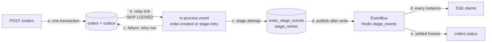
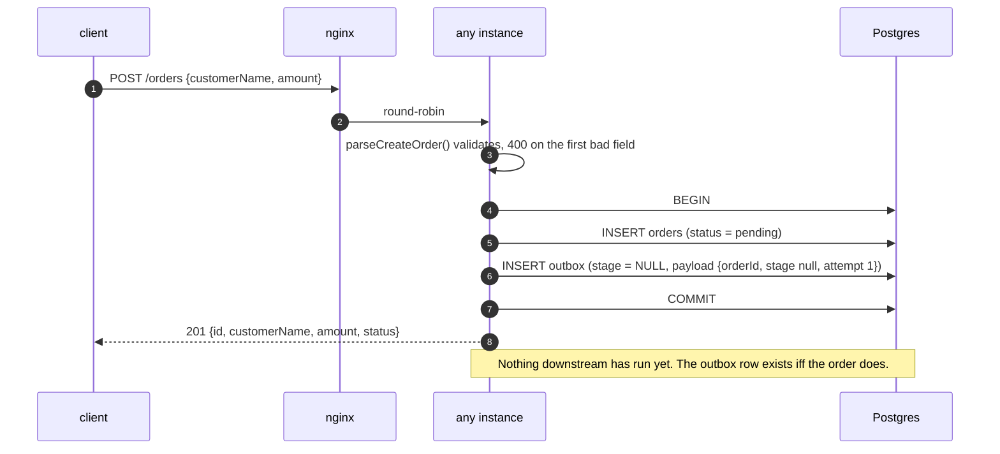
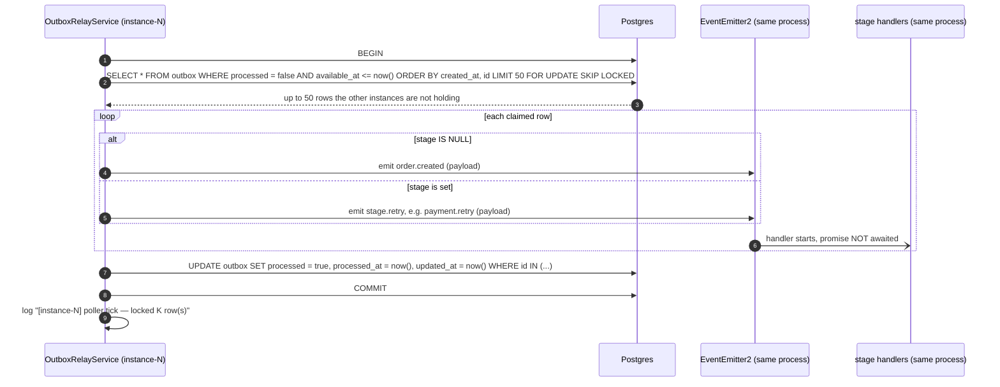
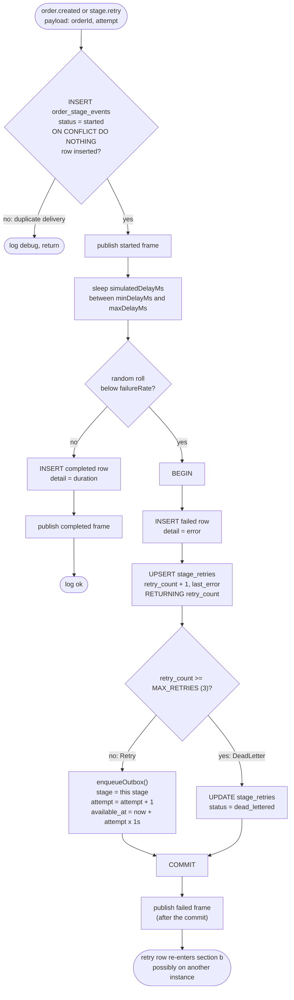
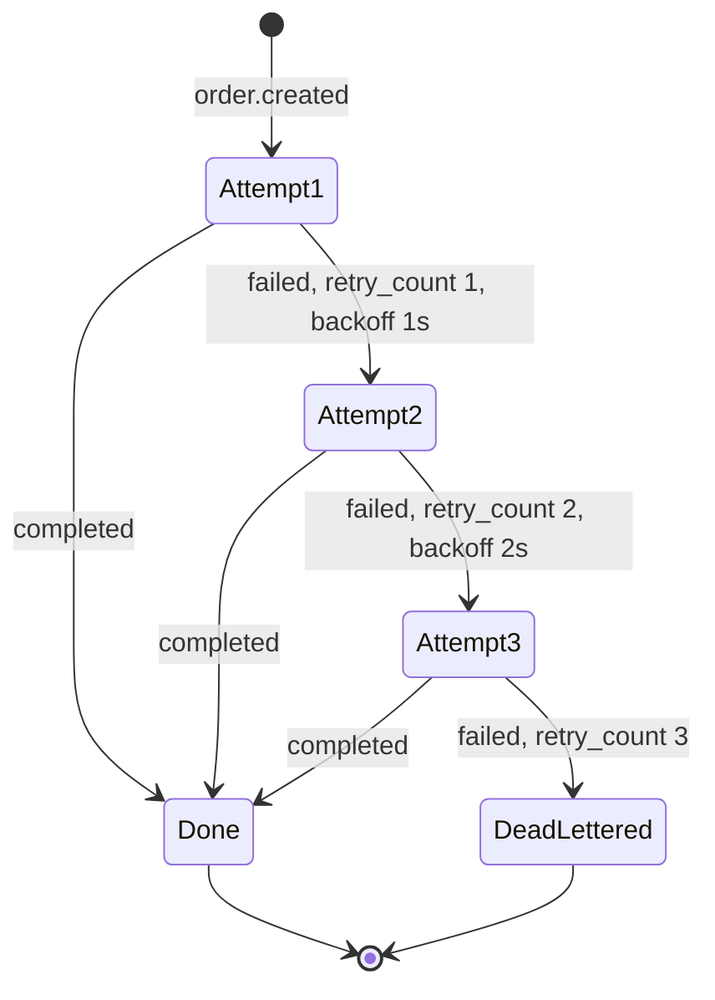
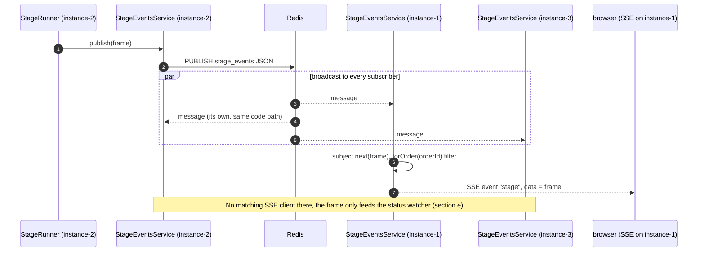
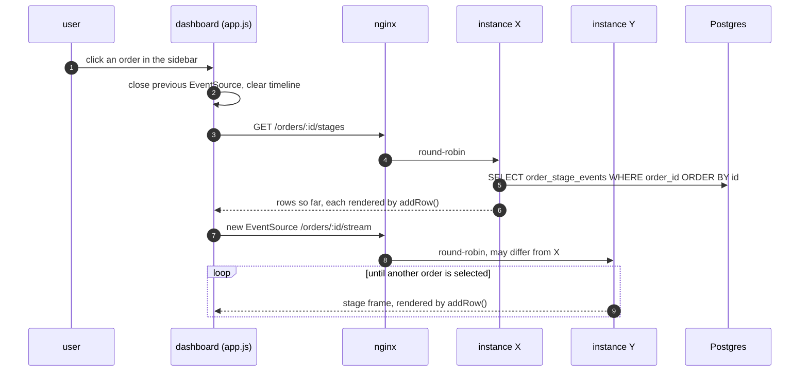
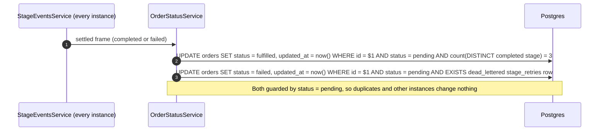
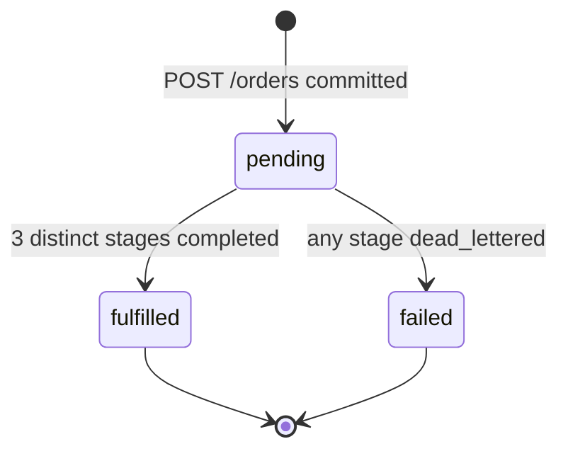
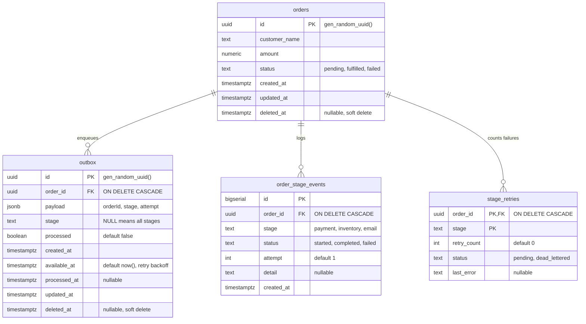

# Data flow

Every path a request or event takes through the system, in the order an order experiences
them. Each section names the code that implements it. For why the pieces exist, see
[architecture.md](architecture.md).

The whole journey in one picture:

## a. Order creation

`OrdersController.create` → `OrdersService.create` → `enqueueOutbox()`.

The untagged outbox row (`stage IS NULL`) means "fan this order out to every stage". Its
`available_at` defaults to `now()`, so the next relay tick on any instance can claim it.
Detail: [src/modules/orders/README.md](../src/modules/orders/README.md).

## b. Outbox relay tick

`OutboxRelayService.poll` runs on `@Interval(2000)` on every instance. A `running` flag stops
one instance's ticks from overlapping.

Points that follow from this shape:

- **Rows are marked processed before any stage finishes.** The emit returns immediately; the
  stages run concurrently in the same process after the relay's transaction commits. Stages
  never touch the outbox row they came from.
- **At-least-once.** Events are emitted before the commit that marks their rows processed; if
  that commit fails, the rows are claimed again on a later tick and re-emitted. Stage-level
  idempotency (section c) absorbs the duplicate.
- **A lost attempt stays lost.** If the instance dies mid-stage, the row is already processed
  and nothing re-enqueues it (no visibility timeout).
- **Work stays on the claiming instance.** All three stages of an untagged row run on the
  instance that claimed it; a retry is a new row and may be claimed anywhere.

Detail: [src/modules/outbox/README.md](../src/modules/outbox/README.md).

## c. Stage attempt

`StageHandler.onOrderCreated` / `onRetry` → `StageRunner.run` → `attempt` → `claim`,
`record`, `fail`, `publish`. `run()` catches everything: eventemitter2 discards the handler's
promise, and an unhandled rejection would exit the Node 20 process.

The attempt/retry lifecycle of one `(order, stage)` pair:

Notes:

- The `completed` insert and its publish are not in a transaction: a single insert needs none.
  `record()` uses `ON CONFLICT DO NOTHING` there too, so a duplicate reaching `completed`
  does not throw on a row that is already correct.
- Publishing is best-effort: a failed publish logs a warning and the attempt carries on,
  because Postgres already has the row.
- Backoff lives in the database (`available_at`), so restarting an instance mid-backoff loses
  nothing.

Detail: [src/modules/stages/README.md](../src/modules/stages/README.md).

## d. Live updates

Every stage-event row is followed by a `StageEventFrame` published to `EventChannel.StageEvents`
(`stage_events`). Every instance subscribes, including to its own messages, and feeds its local
SSE connections from that one subscription.

### Dashboard: hydrate, then subscribe

`public/js/app.js` `select(id)`:

The stream only carries what happens from the moment it opens, which is why hydration comes
first. Hydration rows and SSE frames share one shape (including `createdAt`), so both render
through `addRow()`. There is no replay or de-duplication: a frame published between the
hydration query and the stream opening can be missed (or, if its row was committed just
before the query and published just after the stream opened, shown twice). Reselecting the
order re-hydrates from Postgres, which is always authoritative. The sidebar separately polls
`GET /orders` and `GET /dead-letters` every 2s.

Detail: [src/modules/stage-events/README.md](../src/modules/stage-events/README.md).

## e. Status settlement

`OrderStatusService` subscribes to `StageEventsService.settled()`: every frame except
`started`, since a `started` row can never change an order's status. Because the event bus
broadcasts, **every instance** runs the recompute for every settled frame; the guard makes the
repeats harmless.

A recompute error is logged and dropped; the next settled frame for that order recomputes
from scratch. Detail: [src/modules/status/README.md](../src/modules/status/README.md).

## Schema

Four tables, from `src/infrastructure/database/migrations/` (`InitSchema`, then
`AddAuditColumns` for `updated_at`/`deleted_at` on the two `BaseEntity` tables).

| Table | Keys and indexes | Written by |
| --- | --- | --- |
| `orders` | PK `id` | `OrdersService.create` (insert), `OrderStatusService` (status `UPDATE`s) |
| `outbox` | PK `id`; `idx_outbox_claimable (processed, available_at)` matches the claim predicate | `enqueueOutbox()` (insert), `OutboxRelayService` (mark processed) |
| `order_stage_events` | PK `id`; `uq_stage_attempt UNIQUE (order_id, stage, attempt, status)` is the idempotency guard | `StageRunner.record()` only, append-only |
| `stage_retries` | PK `(order_id, stage)` | `StageRunner.fail()` (upsert, dead-letter) |

`orders` and `outbox` extend `BaseEntity`: TypeORM stamps `updated_at` on its own writes, and
raw SQL `UPDATE`s (the status watcher) set `updated_at = now()` explicitly. Nothing
soft-deletes yet; raw reads that should honour `deleted_at` need their own
`deleted_at IS NULL`. Existing rows got `updated_at = created_at` from the migration, so the
column never claims a row changed when it did not.
