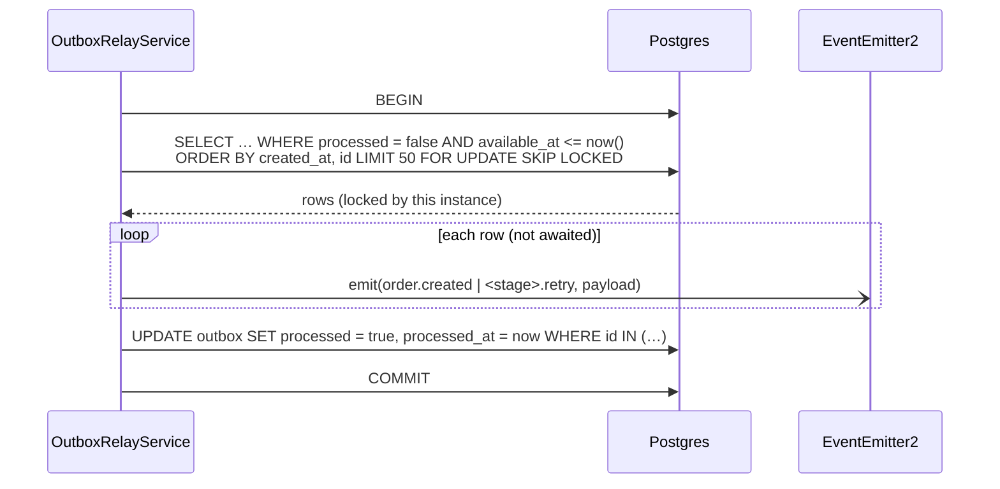

# outbox

The transactional outbox and its relay. Other features write outbox rows on their own
transaction through `enqueueOutbox()`; `OutboxRelayService` on **every** instance polls the
table every 2s, claims due rows with `FOR UPDATE SKIP LOCKED`, turns each into an in-process
event, and marks them processed — all in one transaction. There is no leader: `SKIP LOCKED`
is what lets all instances compete for the same table without handing one row to two of them.

## Events

- **In:** none — it is driven by `@Interval(OUTBOX_POLL_INTERVAL_MS)` (2000 ms).
- **Out (EventEmitter2, in-process only):**
  - untagged row (`stage = NULL`) → `order.created` (`OrderEvent.Created`), consumed by every stage;
  - tagged row (`stage = 'payment'` …) → `<stage>.retry` (`stageEvent(stage, 'retry')`), consumed only by that stage.
  - The event payload is the row's `payload`: `{ orderId, stage, attempt }`.

No HTTP routes.

## Files

- `outbox.module.ts` — provides `OutboxRelayService` (no `forFeature`; `OutboxEntity` is used only through the manager).
- `services/outbox-relay.service.ts` — the poller: `poll()` (tick guard + logging) and `claimAndEmit()` (the transaction).
- `helpers/enqueue-outbox.helper.ts` — `enqueueOutbox(manager, entry)`, the single write path into `outbox`.
- `entities/outbox.entity.ts` — `OutboxEntity` on `outbox`, indexed on `(processed, available_at)`.
- `types/outbox.types.ts` — `OutboxPayload` (emitted body) and `OutboxEntry` (what callers pass in).
- `consts/outbox.constants.ts` — `OUTBOX_BATCH_SIZE = 50`, `OUTBOX_POLL_INTERVAL_MS = 2000`.
- `tests/` — `enqueueOutbox` against an insert recorder; the relay against a fake DataSource, query-builder chain and EventEmitter2.

## One relay tick

## Invariants and why

- **Only `enqueueOutbox()` writes outbox rows, on the caller's EntityManager.** It never opens
  its own transaction, because the whole point of an outbox row is to commit atomically with
  the state change that caused it. Building `payload` from the same arguments also keeps the
  `stage` column and `payload.stage` from ever disagreeing. Omitting `availableAt` leaves the
  column default (`now()`), i.e. deliverable immediately; stages pass a future time for backoff.
- **Emits are not awaited.** Awaiting would hold the row locks for the whole simulated stage.
  EventEmitter2 discards handler promises, so every handler must swallow its own failures —
  see `StageRunner.run`. Don't add awaits here to "fix" that.
- **Delivery is at-least-once.** Events are emitted before the commit that marks rows
  processed, so a failed commit replays them. Stages absorb duplicates via the unique index
  on `order_stage_events`, not via the relay.
- **One tick at a time per instance.** `poll()` returns immediately while a previous tick is
  still running, and catches and logs any error so the interval keeps going.
- **Backoff lives in the database** (`available_at`), not in a process-local timer, so a
  restart mid-backoff costs nothing and a retry can be claimed by any instance.
- Known gap: a crash after claiming but before a stage finishes leaves that work lost until
  something re-enqueues it (no visibility timeout). See the root README "Known limits".

## Talks to

- **orders** — calls `enqueueOutbox()` for the untagged first row when an order is created.
- **stages** — calls `enqueueOutbox()` for stage-tagged retry rows; consumes `order.created` / `<stage>.retry`.
- **config** — `appConfig.instanceId` for log lines.
- **shared** — `OrderEvent`, `stageEvent`, `StageName` from `@shared/pipeline`.
