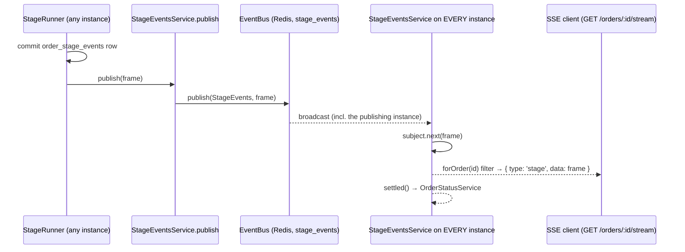

# stage-events

Owns the `order_stage_events` audit log and the live feed built on it: publishes every stage
frame to the cross-instance `EventBus`, and serves hydration (REST) and live updates (SSE) to
the dashboard.

## Routes and events

| Direction | What |
| --- | --- |
| in (HTTP) | `GET /orders/:id/stages?limit=&order=` — rows for the order via `ListStageEventsQueryDto`, `ORDER BY id` oldest first by default (hydration) |
| in (HTTP) | `GET /orders/:id/stream` — SSE, one `stage` event per frame for that order |
| in (call) | `publish(frame)` — called by `stages` after each commit |
| out (bus) | `EventChannel.StageEvents` (`stage_events`) — every frame, to every instance |
| out (Rx) | `forOrder(id)` — frames for one order (one SSE connection) |
| out (Rx) | `settled()` — non-`started` frames, consumed by `status` |

`:id` is validated with Nest's `ParseUUIDPipe` (400 on a non-uuid).

## Files

- `stage-events.module.ts` — registers the entity, controller and both services; exports `StageEventsService`.
- `controllers/stage-events.controller.ts` — the two routes above (no queries of its own).
- `dtos/list-stage-events-query.dto.ts` — extends `BaseQueryDto`, redeclares `order` to default to `Asc`.
- `services/stage-events.service.ts` — bus publish/subscribe and the local `Subject` fan-out.
- `services/stage-event-history.service.ts` — `listForOrder()`, the read side of `order_stage_events`.
- `entities/order-stage-event.entity.ts` — `OrderStageEventEntity` (bigserial id, no `BaseEntity`).
- `types/stage-events.types.ts` — `StageEventFrame`, the one wire contract.
- `tests/` — service (fake in-memory `EventBus`) and controller specs.

## Flow

## Invariants and why

- **One path for local and remote frames.** An instance does not push its own frames straight
  to its SSE clients; it waits for them to come back from the bus like everyone else's. A
  browser attached to instance-1 therefore sees orders claimed by instance-2.
- **The bus must broadcast.** A load-balancing transport would leave two-thirds of SSE clients
  silent (see root README, "Why Redis").
- **No replay on the stream.** SSE only carries frames from subscription onward, so the
  dashboard hydrates from `GET /orders/:id/stages` first, then opens the stream.
- **Same shape on both paths.** `StageEventFrame.createdAt` matches the row's `created_at`, so
  hydration rows and live frames render through one code path with a server timestamp.
- **`settled()` drops `started`.** A `started` row can never decide an order's status.
- **The unique `(order_id, stage, attempt, status)` index** is the stage idempotency guard; this
  table is append-only (bigserial id, hence no `BaseEntity` / `updated_at`).

## Talks to

- `stages` → calls `publish()` after its transaction commits (never inside it).
- `status` → subscribes to `settled()`.
- `@infrastructure/event-bus` → injected abstract `EventBus`; no ioredis here.

## Dashboard (`public/js/`)

The SSE consumer. No bundler; `app.js` is the entry.

- `app.js` — on select: close the old `EventSource`, hydrate via `/stages`, open `/stream`.
- `api.js` — `getJson()`: every read goes through it so a non-2xx becomes a rejected promise;
  bare `fetch` resolves on 404/500 and would hand callers `undefined` fields to render.
- `dom.js` — all DOM construction, with deliberately no HTML-accepting path. `customerName` and
  stage `detail` are user-supplied; `innerHTML` would turn a name like
  `` into executed script, so every node is built with `textContent`.
- `timeline.js` — the stage table for the selected order; hydration rows and SSE frames share
  one shape (`createdAt` included), so both render through `addRow()`.
- `sidebar.js` — polls orders and dead letters every 2s, render-diffed by key.
- `format.js` — UTC time formatting (needs dayjs `localizedFormat` for `LTS`) and short ids.
