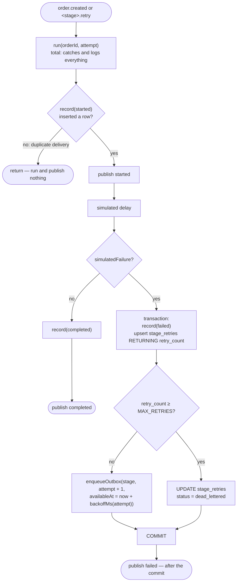

# stages

The three simulated pipeline stages (`payment`, `inventory`, `email`). Each one claims an
attempt, does its (randomised) work, records the outcome in `order_stage_events`, and on
failure hands a durable retry back to the outbox or dead-letters the `(order, stage)` pair.

## Events

| Direction | Event / channel | Source / target |
| --- | --- | --- |
| consumed | `order.created` (`OrderEvent.Created`) | every stage's first attempt, emitted by `OutboxRelayService` for an untagged outbox row |
| consumed | `<stage>.retry` (`stageEvent(stage, 'retry')`) | only that stage, emitted for an outbox row tagged with it |
| emitted | `StageEventFrame` (`started` / `completed` / `failed`) | `StageEventsService.publish()` → event bus channel `stage_events` → SSE + `OrderStatusService` |
| written | outbox row with `stage` set and a future `available_at` | `enqueueOutbox()` inside the failure transaction |

## Files

| Folder | File | Role |
| --- | --- | --- |
| root | `stages.module.ts` | registers `STAGE_HANDLERS` as providers; imports `StageEventsModule` |
| `services/` | `stage-runner.service.ts` | `StageRunner`, the abstract base holding all stage logic |
| `services/` | `stage-handler.factory.ts` | `stageHandler()` builds one `@OnEvent` provider class per `STAGE_CONFIGS` row; `STAGE_HANDLERS` |
| `helpers/` | `retry-policy.helper.ts` | `backoffMs()`, `nextActionAfterFailure()` |
| `helpers/` | `stage-simulation.helper.ts` | `simulatedDelayMs()`, `simulatedFailure()` — pure, the random roll is passed in |
| `entities/` | `stage-retry.entity.ts` | `StageRetryEntity` (`stage_retries`, composite key `order_id, stage`) |
| `consts/` | `stages.constants.ts` | `STAGE_CONFIGS`, `MAX_RETRIES`, `BACKOFF_STEP_MS` |
| `types/` | `stages.types.ts` | `StageConfig`, `RetryDecision`, raw row types |
| `tests/` | `*.spec.ts` | helpers, factory metadata, and `StageRunner` behaviour against in-memory fakes |

## Attempt lifecycle

## Invariants and why

- **`run()` is total — it must never reject.** `@OnEvent` handlers are dispatched by
  eventemitter2's synchronous `emit`, which discards the promise a handler returns, so a
  rejection would surface as an unhandledRejection, and Node 20 answers those by exiting:
  an instance with a green healthcheck would die on a transient query error. Losing one
  attempt (logged at `error`; its outbox row is already processed, so only a manual
  re-enqueue re-runs it) is the lesser failure. Don't add awaits in the relay to "fix" this.
- **Inserting the `started` row is the claim.** `order_stage_events` is unique on
  `(order_id, stage, attempt, status)`; a duplicate delivery of the same attempt collides and
  inserts nothing, so each attempt runs once despite at-least-once delivery.
- **`record()` is the single write into `order_stage_events`, and uses `ON CONFLICT DO
  NOTHING` for every status, not only the claim:** a duplicate delivery reaching `completed`
  would otherwise violate the unique index and throw for a row that is already correct on disk.
- **The failure row, the retry counter and the queued retry share one transaction**, so a
  stage can never be recorded as failed without its retry existing — and the retry lives in
  the database, surviving the death of this process, unlike a `setTimeout` backoff would.
- **The failed frame is published after the commit.** The status watcher decides "is this
  order dead?" by reading `stage_retries`; a subscriber notified mid-transaction cannot see the
  `dead_lettered` row yet, and since a dead letter is the last event that order ever emits,
  publishing early left orders `pending` forever.
- **A failed publish is swallowed.** The live stream is a read model; Postgres still has the
  row, so it costs one dashboard frame.
- **Retry counting.** `nextActionAfterFailure(retryCount)` receives the failure count *including*
  the one just recorded; at `MAX_RETRIES` it dead-letters instead of enqueueing, so a stage makes
  at most `MAX_RETRIES` attempts in total. Backoff is `attempt × BACKOFF_STEP_MS`.
- **One distinct class per stage.** `stageHandler()` must build a new class for each config,
  not instantiate one class three times: `@OnEvent` metadata lives on the prototype and the
  retry event differs per stage. Each class subscribes to exactly `order.created` and its own
  `<stage>.retry`. The constructor is redeclared in the subclass so `emitDecoratorMetadata`
  records the param types Nest injects (`DataSource`, `StageEventsService`, `appConfig.KEY`),
  and the class `name` is set to `PaymentService` etc. because it is the Logger context.

## Adding a stage

1. Add the name to `StageName` and `STAGES` in `src/shared/pipeline.ts`.
2. Add a row to `STAGE_CONFIGS` in `consts/stages.constants.ts` (the `Record<StageName, …>`
   type makes the compiler insist).

`STAGE_HANDLERS` builds and registers its handler; the new stage automatically receives
`order.created` and gets its own `<stage>.retry`.

## Collaborators

- **outbox** — the relay emits the two consumed events; this module writes retry rows only via
  `enqueueOutbox()` (`@modules/outbox/helpers/enqueue-outbox.helper`) on the failure
  transaction's manager, with `stage` set so the relay emits `<stage>.retry`.
- **stage-events** — every recorded row is followed by `StageEventsService.publish()` with a
  `StageEventFrame`, which fans out over the event bus to every instance's SSE clients and to
  `OrderStatusService`.
