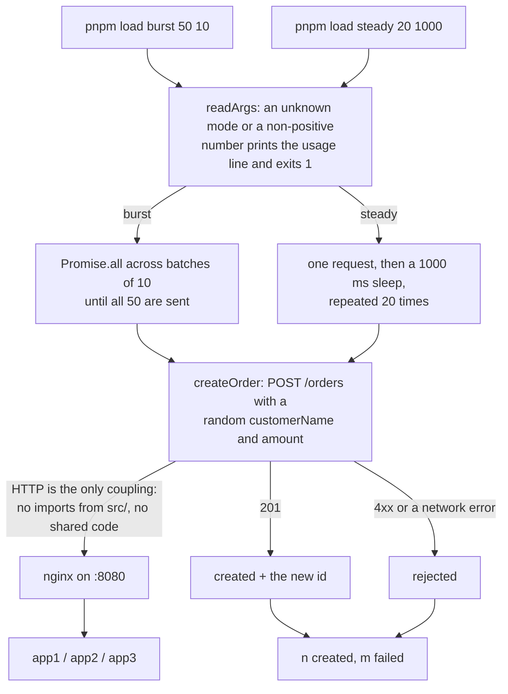

# load-generator

Sends HTTP requests at a running order-outbox-lab stack. That is its whole job: it lives in
this repo, but it imports nothing from `src/` and knows nothing about the app's internals.
One endpoint, `POST /orders`, over the network.



`burst` and `steady` differ only in how they pace the same `createOrder` call. Everything the
generator learns about the pipeline comes back in that call's response, which is why the
summary line counts requests rather than orders fulfilled.

## Setup

Nothing beyond the repo's own `pnpm install` (it runs through `tsx`, a root dev dependency)
and a running stack (`docker compose up -d --build`).

`TARGET_URL` defaults to `http://localhost:8080`. To change it without typing it on every
command, set it in the repo-root `.env` (see `.env.example`); `pnpm load` reads that file if
it exists. The app itself ignores `TARGET_URL`.

## Usage

All commands run from the repo root.

```bash
pnpm load burst 50 10
```

50 orders in batches of 10 concurrent requests. This is the mode that stresses the poller
race: with 10 orders in flight and three instances polling the same table every 2s, you get
to watch `SKIP LOCKED` actually distribute the work:

```bash
docker compose logs -f app1 app2 app3 | grep 'poller tick'
```

```bash
pnpm load steady 20 1000
```

One order per second, twenty times. Slow enough to follow a single order end to end on
<http://localhost:8080/>: it appears in the sidebar, then its payment / inventory / email
rows arrive over SSE as the stage modules finish.

With no arguments it defaults to `steady 20 1000`.

Both modes can point anywhere, which is what makes it usable against a deployed stack rather
than only the local one:

```bash
TARGET_URL=http://staging.example.internal pnpm load burst 100 25
```

## What it does and does not prove

`POST /orders` returns as soon as the order and its outbox row are committed, so a fast
`created <id>` line says the write path is healthy and nothing about the stages. The real
signal is what shows up in `order_stage_events` a moment later: after a burst, check that
every order reached a terminal state for each stage and that no stage completed twice for
the same order.
